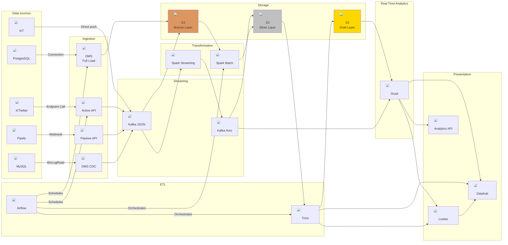

# Data pipeline

## Challenge statement

Gostaríamos de solicitar que você desenhe um fluxo de dados completo, desde a origem até a apresentação para os usuários finais, levando em consideração cenários de streaming e batch, bem como a escalabilidade para o processamento de grandes volumes de dados.

Por favor, inicie descrevendo as fontes de dados que serão utilizadas, como bancos de dados, APIs, sensores IoT, entre outros. Em seguida, demonstre como esses dados serão capturados e processados em tempo real e/ou em batch, ressaltando as diferenças e os benefícios de cada abordagem.

Após o processamento, explique como os dados serão armazenados e organizados em camadas, considerando a estruturação dos dados para facilitar consultas e análises.

Detalhe também como os dados serão disponibilizados para os usuários finais, seja por meio de dashboards interativos, relatórios automatizados, ou outras formas de apresentação de dados.

Ao concluir, fique à vontade para discutir possíveis melhorias no fluxo de dados proposto, incluindo estratégias de otimização, monitoramento, governança de dados, entre outros aspectos relevantes para um ambiente de Data & Analytics eficiente e escalável.

## Data sources

### PostgreSQL

Assumindo que não podemos modificar a config desse DB para fazer uma leitura do logfile.

### MySQL

Leitura em CDC com acesso direto ao binlog.

### X/Twitter

O X (antigo twitter) oferece uma API para ingestão de informações.

### Pipefy

Pipefy é uma ferramenta de kanban e forms que permite o cadastro de um webhook que notifica toda vez que um evento é disparado dentro da ferramenta.

### IoT

Assumindo que o IoT tem servers dedicados e podem oferecer diretamente com pushs ao kafka.

## Architecture proposal

## Ingestion step

Essa é a suite de ferramentas que usaremos para fazer ingestão dos dados, com algumas estratégias possíveis de acordo com o tipo do datasource.

### DMS

Usado para todos os cenários em que se tenha acesso a um banco de dados diretamente.
Existem várias opções desse serviço tanto gerenciado por clouds comuns (AWS/GCP/Azure) bem como open source on premises que podem ser levantado em K8S (Debezium).

#### CDC

Para ingestão de bancos que tenham acesso a configuração para leitura via logfile ou acesso a um CDC sink (como Mongo). As capturas são enviadas diretamente ao Kafka.

#### Full Load

Ingestão de dados por cópias completas para um banco que não tenha possibilidade de fazer CDC e para uso como consistência eventual.
Os loads são enviados diretamente ao storage bronze.

### Active API

Esse é um serviço que recebe uma configuração de conexão/acesso/autorização um endpoint com payload e executa uma requisição salvando os resultados com a requisição no Kafka.

### Passive API

Esse serviço é uma api que você pode registrar no webhook de uma ferramenta e ele vai receber os eventos e salvar no Kafka.

## Streaming step

Aqui fica o backbone de streaming de dados, ele permite que os dados sejam processados em tempo real.

### Kafka JSON

Esses tópicos tem um esquema dinâmico (JSON) para que não exista necessidade de pré definição de schema, o que facilita a ingestão de dados como produzidos pela fonte.

### Kafka Avro

Esses tópicos tem um esquema definido (Avro) para que exista uma garantia de schema e que o final do pipeline possa ser mais confiável e consistente.
A garantia de schema também permite que o dado seja mais facilmente consumido por ferramentas de BI.
A ferramenta para gerenciar schema pode ser o Schema Registry.

## Transformation step

Aqui os dados são processados e transformados para serem consumidos.
Ele precisa ter uma garantia de schema de saída e particionamento para que o dado seja consumido de forma eficiente.
Faz sentido construir uma única lib de transformação que possa ser usada tanto no streaming quanto no batch.

### Spark Streaming

Esse é o serviço que vai processar os dados em tempo real, ele vai pegar os dados do Kafka JSON e transformar em um formato mais estruturado e salvar no Kafka Avro.

### Spark Batch

Esse é o serviço que vai processar os dados em batch, ele vai pegar os dados do storage bronze e transformar em um formato mais estruturado e salvar no storage silver.
Além do cenário de fontes que não possam ser consumidas em tempo real, ele também pode ser usado para reprocessar dados que foram corrompidos ou para fazer backfill, se tornando uma ferramenta também de consistência eventual.

## Storage step

Aqui os dados são armazenados e organizados em camadas para facilitar consultas e análises. A sugestão de ferramenta é o S3 por ser barato e escalável. Todos cloud providers oferecem um serviço de storage similar.

### S3 Bronze Layer

Esses dados são os dados brutos, sem transformação, que são consumidos diretamente do Kafka JSON e do DMS Full Load.
Boas práticas:

- **Source/date partition**: Criar uma pasta por fonte de dados e por dia para facilitar a ingestão e a consulta. Esse é o único particionamento que é feito nessa camada, por ela não ter garantia de schema, não é possível fazer particionamento por coluna específica. Isso não garante um equilíbrio de carga ou tamanho de arquivo/partição.
- **Append only**: não é permitido alterar ou deletar dados nessa camada. Se for necessário fazer alterações, é necessário criar uma nova versão do dado. Isso garante que o dado seja sempre consistente e que seja possível fazer backfill.
- **No schema**: não é permitido fazer alterações no schema do dado, isso garante que o dado seja sempre consistente e que seja possível fazer backfill.
- **Cooling over time**: Após um tempo de não uso, os dados devem ser movidos para um storage mais barato, como o Glacier, para reduzir custos.

### S3 Silver Layer

Esses dados são transformados e tem uma garantia de schema, podem ser usados para consumo direto por ferramentas de BI em um modelo lakehouse.
Os dados aqui tem uma linguagem muito próxima da linguagem da ferramenta, que não é necessariamente a mesma que a linguagem de negócio.
Boas práticas:

- **ACID**: É uma melhor prática usar um formato de tabela que garanta ACID como o Delta Lake, Iceberg ou Hudi. Minha recomendação é Iceberg devido ao particionamento dinâmico e o hidden partitioning.
- **Partitioning**: Escolher as colunas mais usadas para filtrar como particionamento, isso garante que a consulta seja mais eficiente. É possível começar unicamente com o particionamento por data e ir adicionando mais colunas conforme a necessidade com a análise das queries.
- **Schema evolution**: É possível fazer alterações no schema, mas é necessário garantir que as alterações sejam backward compatible para que não haja perda de dados.
- **Cooling over time**: Após um tempo de não uso, os dados devem ser movidos para um storage mais barato, como o Glacier, para reduzir custos.

Tipos de tabelas mais comuns:

- **historical**: traz todo o histórico de cada entidade, é a tabela mais cara e mais lenta, mas é a única que garante o histórico completo.
- **snapshot**: traz o estado atual de cada entidade, é a tabela mais barata e mais rápida, mas não garante o histórico completo.
- **change-state-capture**: traz o histórico de modificações das entidades do ponto de vista de um estado específico. É um modelo mais rápido de uma histórica, mas só olha modificações com o ponto de vista de um estado específico.

### S3 Gold Layer

Esses dados são dados com linguagem de negócio, são dados que são consumidos diretamente por ferramentas de BI. Eles são particionados pelas colunas mais usadas para filtrar e tem um formato de tabela que garanta ACID.

Tipo de tabelas mais comuns:

- **Fact**: Tabela que traz os fatos, são tabelas que tem a maior quantidade de dados e são as tabelas mais usadas para análise. Normalmente estão associadas a um evento ou a uma transação que aconteceu.
- **Dimension**: Tabela que traz as dimensões, são tabelas que tem a menor quantidade de dados e são as tabelas mais usadas para filtro. Normalmente estão associadas a um objeto que não muda com o tempo.
- **Aggregation**: Tabela que traz as agregações, são tabelas que tem a menor quantidade de dados e são as tabelas mais usadas para análise. Normalmente estão associadas a um resumo de um fato ou de uma dimensão.
Elas são ótimas para performance na leitura, mas não permitem uma auditoria completa do número apresentado e não permitem uma análise de granularidade mais fina.

## ETL step

Nesse step acontecem as queries de transformação e agregação dos dados,
essa etapa contem as regras de negócio que convertem os dados de ferramenta para informação do negócio.
Normalmente acontecem em batch de acordo com a necessidade de atualização dos dados. Qualquer engine de processamento de dados pode ser usada, é interessante essas transformações serem feitas em SQL para facilitar a manutenção e por ser uma franca entre os analistas de dados, engenheiros de dados, bi e cientistas de dados.

### Trino

A sugestão de uso é o Trino por ser uma engine de processamento de dados que permite a execução de queries em diferentes fontes de dados, tem alta escalabilidade e leitura de vários formatos de dados nativamente.
Spark, Presto, Athena, BigQuery, Redshift, Snowflake, entre outros, também são opções válidas.

### Airflow

A sugestão de orquestração é o Airflow por ter uma interface amigável para acompanhar o andamento das tarefas, permitir a execução de tarefas em paralelo, ter uma grande comunidade e ser altamente customizável.
Luigi, Prefect, Dagster, step functions, também são opções válidas.

Também é possível usar o Airflow para agendar a execução de tarefas de ingestão.

### SQLMesh

SQL mesh permite usar uma estrutura SQL que abstrai a engine de processamento de dados, permitindo que a query seja executada em diferentes engines de processamento de dados facilitando um failover e a migração de dados entre diferentes engines de processamento de dados.
Também permite a criação de tests (equivalente a unit tests) e audits (equivalente a integration tests) com os dados, garantindo qualidade tanto no código das queries (unit test) quanto na qualidade dos dados de entrada/saída (integration tests).

## Real Time Analytics step

Aqui é importante uma ferramenta que permita mesclar dados em tempo real com dados históricos, que permita fazer queries complexas e que tenha uma interface amigável para os usuários finais.

### Druid

A sugestão de uso é o Druid por ser uma ferramenta de OLAP que permite a ingestão de dados em tempo real e batch, tem alta escalabilidade e permite queries complexas em tempo real.

## Presentation step

Importante uma ferramenta de BI que permita dashboards tanto real time quanto históricos, que permita a criação de relatórios automatizados e que tenha uma interface amigável para os usuários finais.

### Looker

A sugestão do looker é por ele criar uma camada semântica (LookML) que permite que os usuários finais façam queries sem precisar saber SQL, ele também permite a criação de dashboards e relatórios automatizados. Isso facilita o uso por usuários finais que não tem conhecimento técnico.

### Analytics API

Essa é uma API que permite que os dados sejam consumidos por outras ferramentas, como um app ou um site, de forma programática.
Aqui várias opções são possíveis com leitura direta ao druid ou usando um criando uma camada de cache com Redis ou Memcached.

### DataHub

Datahub é uma ferramenta que permite a criação de um catálogo de dados, que permite que os usuários finais saibam quais dados estão disponíveis e como eles podem ser consumidos.
Também permite a criação de uma camada de governança, tagging e lineage dos dados. Isso facilita o uso por usuários finais que não tem conhecimento técnico a saber quais dados estão disponíveis e como eles podem ser consumidos.

## Monitoring

Para monitorar o pipeline é importante usar uma ferramenta de monitoramento que permita a visualização de métricas de performance, de qualidade e de disponibilidade.

### New Relic

Usando adequadamente o log ao longo do pipeline é possível monitorar o tempo de execução, o número de erros, a qualidade dos dados, a disponibilidade do pipeline, entre outros.

## Improvements

- Não foi considerado ingestão de arquivos de mídia, como imagens, vídeos e áudios, que podem ser feitos diretamente no storage bronze, mas precisam trafegar como metadados ao longo do pipeline.
- Não foi considerado a necessidade de garantir a privacidade dos dados, que pode ser feita com encriptação e máscaras de dados. Algumas das ferramentas usadas no pipeline oferecem essa funcionalidade nativamente.
- Science pipeline não está definido também um caminho claro para a criação de modelos de machine learning, que podem ser feitos diretamente no storage silver ou gold, mas precisam de uma camada específica para garantir a consistência dos dados.
